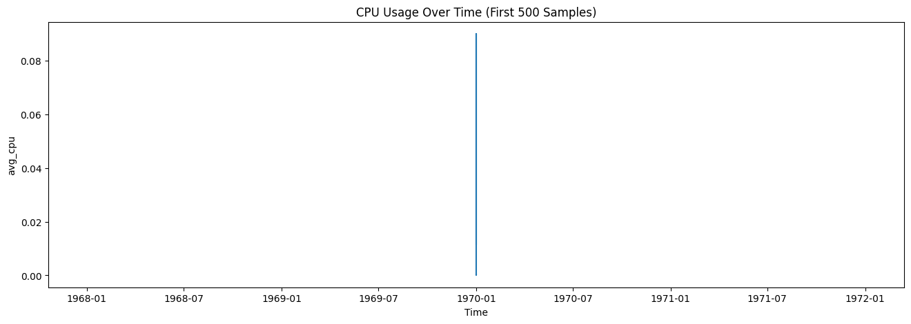
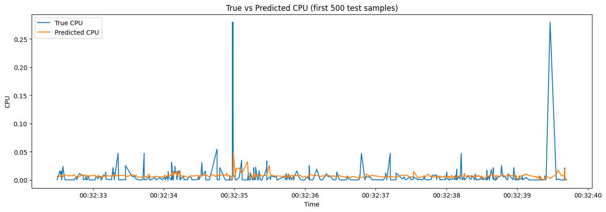
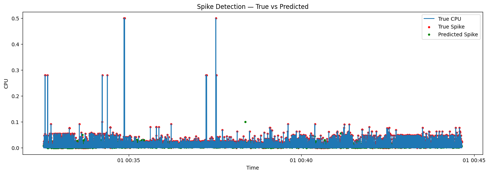
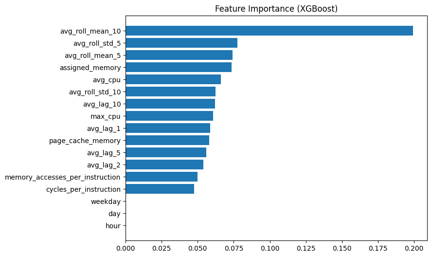
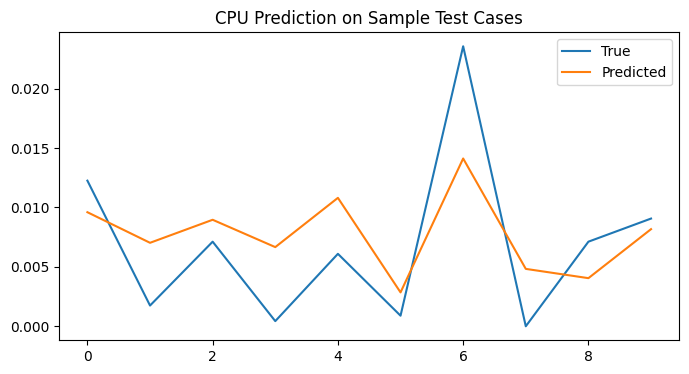

# CPU-Spike-Forecasting-on-Google-Cluster-Workload-Traces
Author: Arpit Sharma

**📌 Project Overview**

Modern data centers handle unpredictable workloads. Sudden spikes in CPU usage can degrade user experience or trigger service downtime.
This project uses time-series Machine Learning to predict CPU load in advance using real Google Cluster (Borg) telemetry data and flag high-load events before they occur.

The final model can support automated auto-scaling, alerting, and preventive resource allocation.

**📂 Dataset**

The dataset is derived from Google Borg Cluster Usage Traces, containing resource telemetry generated from production datacenters.

Key fields used:

| Column                          | Description                  |
| ------------------------------- | ---------------------------- |
| time                            | timestamp of event           |
| machine_id                      | unique node identifier       |
| average_usage                   | CPU & memory resource usage  |
| maximum_usage                   | max usage in sample interval |
| assigned_memory                 | memory allocated             |
| page_cache_memory               | memory used for caching      |
| cycles_per_instruction          | compute intensity            |
| memory_accesses_per_instruction | memory pressure              |

More than 280,000 rows were used after cleaning.

**🔧 Feature Engineering**

To transform raw cluster logs into ML-ready time-series features:

| Feature Category | Examples                               |
| ---------------- | -------------------------------------- |
| Time Features    | hour, day, weekday                     |
| Lag Features     | avg_cpu lag 1, 2, 5, 10                |
| Rolling Window   | rolling mean & std (5 & 10 timestamps) |
| Usage KPIs       | avg_cpu, max_cpu, assigned_memory      |

The target is:

target_future_usage = CPU usage at next timestamp

**🔥 Machine Learning Models**

Three models were trained and compared:

| Model                  | RMSE        | MAE         |
| ---------------------- | ----------- | ----------- |
| Linear Regression      | 0.00958     | 0.00536     |
| Random Forest          | 0.00967     | 0.00543     |
| **XGBoost (Selected)** | **0.00965** | **0.00546** |

Performance was similar across models due to gradual CPU change between timestamps, but XGBoost was chosen for:

   -Best generalization
   -Industry adoption in time-series tabular forecasting
   -Ability to handle nonlinear workload behavior

**🚨 Spike Detection Logic**

After predicting future CPU load, spikes were identified:
spike if predicted_CPU > 1.5 × rolling_mean_10

Outputs:

-spike_true → actual spike events
-spike_pred → predicted spike events

Evaluation via precision, recall and F1 captured spike detection quality.

## 📊 Visualizations

### CPU Usage Over Time
Shows overall fluctuations and load patterns in the Google cluster dataset.

  

### True vs Predicted CPU on Test Set
Evaluates model performance visually.

  

### Spike Detection — True vs Predicted
Red points = true spikes  
Green points = predicted spikes  

  

### Feature Importance (XGBoost)
Shows which inputs were most important for forecasting CPU.

  

### Sample Test Predictions
10 randomly selected inference samples — predicted vs true.

  

These visualizations help explain model behavior clearly to stakeholders.

**🧪 Sample Test Inference Output**

A testing module prints predicted CPU vs actual next-timestamp CPU:
Time: 2023-05-18 01:15 | True next CPU: 0.07214 | Predicted: 0.06988
Time: 2023-05-18 04:20 | True next CPU: 0.01158 | Predicted: 0.01502
...
A separate line plot compares the 10 inference samples visually.

**💾 Model Export**

The final model is exported using Joblib:
joblib.dump(xgb, "cpu_spike_predictor.joblib")

This model can be integrated into:

-Monitoring dashboards
-Auto-scalers
-Alerting systems

**▶ How to Run**

Open notebook.ipynb in Google Colab:

-Upload or mount dataset through Google Drive
-Run cells sequentially
-The last section contains sample inference and spike visualization

#🧭 **Possible Future Work**
| Improvement                    | Value                               |
| ------------------------------ | ----------------------------------- |
| Use GRU / LSTM deep learning   | Capture long-range patterns         |
| Predict multi-step ahead load  | 30-minute and 1-hour forecasting    |
| Include network / disk metrics | Full resource-saturation monitoring |
| Real-time streaming inference  | Production-ready deployment         |

**🎯 Key Takeaway**

This project shows that ML can forecast datacenter CPU load in advance and detect high-volume spikes, enabling proactive scaling and improved system reliability.
